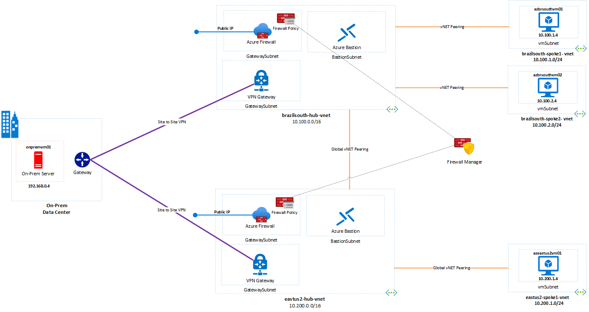
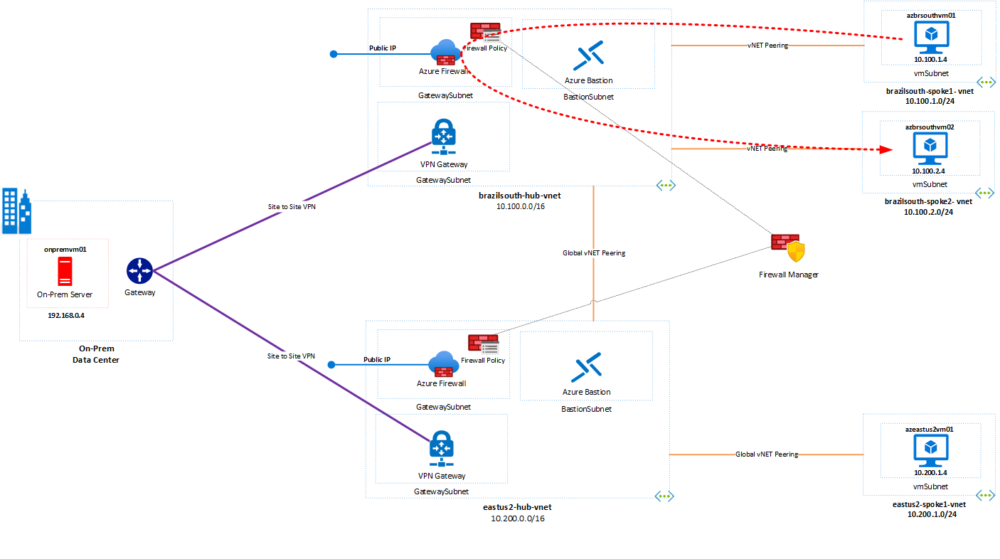

## **Protect your Enviroment with Azure Firewall and Firewall Manager Microhack**

## Contents:
1. [Introduction](#introduction)</br>
2. [Objectives](#objectives)</br>
3. [Scenario](#scenario)</br>
4. [Overview](#Overview)</br>
5. [Prerequisites](#Overview)</br>
6. [Close-out](#close-out)
## Introduction
Azure Firewall is a managed, cloud-based network security service that protects your Azure Virtual Network resources. It's a fully stateful firewall as a service with built-in high availability and unrestricted cloud scalability. It`s part of the core complement for security in your Azure virtual network and improves security maturity organizations when deciding to implement the Zero Trust model.

The purpose of this MicroHack is to build an understanding of the use of Azure Firewall with a focus on the network and security capabilities recently introduced. Please consider the following articles required as pre-reading to build a foundation of knowledge.

[What is Azure Firewall?](https://docs.microsoft.com/en-us/azure/firewall/overview)</br>
[Azure Firewall features](https://docs.microsoft.com/en-us/azure/firewall/features)</br>
[What is Azure Firewall Manager?](https://docs.microsoft.com/en-us/azure/firewall-manager/overview)

## Objectives
After completing this MicroHack you will be able to:

## Scenario
Contoso, Ltd. is a consulting company with the main office in Brazil and another branch office in the US; they are using Azure to host their workloads in two different regions. As part of their cloud journey, the Security and Cloud Team has started to look at a security cloud-native solution as the Azure Firewall.
## Prerequisites

The elements of Microhack are using a predefined Terraform template to deploy the base environment. You will deploy these resources in your Azure subscription in two differents Azure regions: *Brazil South and EastUS2*. At the end of this section, your base environment build looks as follows:



In summary:

### Task 1 - Deploy the Environment

To start the terraform deployment, follow the steps listed below:

- Login to Azure Portal [https://portal.azure.com/](https://portal.azure.com/)
    - To start Azure Cloud Shell:
        - Select the Cloud Shell button on the menu bar at the upper right in the Azure portal. 

    

- Ensure you are properly logged in to your tenant and with a subscription selected for Azure. You can check that by using:

```azure cli
az account list --output table
az account set --subscription "My Subscription"
```

- Clone the following GitHub repository 

```azure cli
git clone https://github.com/adicout/microhack/
```

- Go to the folder azure-firewall/terraform and initialize the terraform modules and download the azurerm resource provider

```azure cli
terraform init
```

- Now run apply to start the deployment (When prompted, confirm with a **yes** to start the deployment)

```azure cli
terraform apply
```

- Wait for the deployment to complete. This will take around 30 minutes (the VPN gateways, Azure Firewall take a while).

### Task 2 - Explore and verify the deployed resources

After the Terraform deployment concludes successfully, verify if the resources have been implemented.

- Login to Azure Portal [https://portal.azure.com/](https://portal.azure.com/)
    - To start Azure Cloud Shell:
        - Select the Cloud Shell button on the menu bar at the upper right in the Azure portal. 

    

```azure cli
az resource list --name firewall-microhack-rg
```
Verify if you can access all four virtual machines via Azure Bastion, using the following information:

- *Username: azureadmin*</br>
- *Password: HackP@ssw0rd* 

### Task 3 - Create a Log Analytics Workspace

As part of the Microhack you will require to create a workspace in the log Analytics to sent the Azure Firewall diagnostic logs. 

1. Login to Azure Portal [https://portal.azure.com/](https://portal.azure.com/)
    - To start Azure Cloud Shell:
        - Select the Cloud Shell button on the menu bar at the upper right in the Azure portal. ->

    

2. Run the follow command: 

```azure cli
az monitor log-analytics workspace create -g firewall-microhack-rg  -n azurenetworkmonitor 
```
:exclamation: In workspace name **Enter Unique Name all lowercase**

2. Validate if **Log Analytics** created in the Azure Portal, under the Log Analytics Workspace.

``` Azure CLI
az monitor log-analytics workspace list -g firewall-microhack-rg  --output table
```

:point_right: Check on the Azure portal under the resource group if the resource is created.
### Task 4: Enable diagnostic logging for Azure Firewall

1. In the Azure portal, open the Azure Cloud Shell:

    - Select the Cloud Shell button on the menu bar at the upper right in the Azure portal. 

    

2. Run the follow command: 

```azure cli
az monitor diagnostic-settings create -n 'toLogAnalytics'
   --resource '/subscriptions/<subscriptionId>/resourceGroups/firewall-microhack-rg/providers/Microsoft.Network/azureFirewalls/brazilsouth-hub-firewall'
   --workspace '/subscriptions/<subscriptionId>/resourceGroups/firewall-microhack-rg/providers/microsoft.operationalinsights/workspaces/<workspace name>'
   --logs '[{\"category\":\"AzureFirewallApplicationRule\",\"Enabled\":true}, {\"category\":\"AzureFirewallNetworkRule\",\"Enabled\":true}, {\"category\":\"AzureFirewallDnsProxy\",\"Enabled\":true}]' 
   --metrics '[{\"category\": \"AllMetrics\",\"enabled\": true}]'
```
3. Verify if **diagnostic settings** created in the Azure Portal>Firewall, Under Monitoring, select Diagnostic settings.

:point_right: Repeat at the same steps 2 and 3 for **eastus2-hub-firewall**

### Task 4: Deploy the workbook for Azure Firewall

1. Follow step-by-step in the [Monitor logs using Azure Firewall Workbook](https://docs.microsoft.com/en-us/azure/firewall/firewall-workbook/)  to deploy the workbook for Azure firewall in Log Analytics workspace.

## Challenges

After you finished the base lab deployed you can progress to the Azure Firewall and Firewall Manager Microhack challenges!

### Challenge 1 : Use Azure Firewall for Intra-region Forwarding

In this challenge, you will establish communication between spokes virtual networks using a firewall inside the hub virtual network to forward the networking traffic to the same region. You will then inspect effective routes on the spoke VMs and run the simple ping test.

#### Task 1 - Deploy a User Defined Route for spokes virtual networks

Connect to **azbrazilsouthvm01** via Bastion, open the command prompt and try to ping the **azbrazilsouthvm02**.

:question: What is the result?

Check the routing on **azbrsouthvm01**, using the Azure Cloud Shell:

```azure cli
az network nic show-effective-route-table -g firewall-microhack-rg -n spoke-1-nic --output table
```
:question: Any route to **azbrsouthvm02**?

Configure a existing route table using the Azure Cloud Shell for subnet on the spokes virtual networks in Brazil South region.

```azure cli
az network route-table route create --name to-brazilsouth-spoke2 --resource-group firewall-microhack-rg --route-table-name rt-brazilsouth-spoke1-vmsubnet --address-prefix 10.100.2.0/24 --next-hop-type VirtualAppliance --next-hop-ip-address 10.200.3.4
az network route-table route create --name to-brazilsouth-spoke1 --resource-group firewall-microhack-rg --route-table-name rt-brazilsouth-spoke2-vmsubnet --address-prefix 10.100.1.0/24 --next-hop-type VirtualAppliance --next-hop-ip-address 10.200.3.4
az network vnet subnet update --name vmsubnet --vnet-name brazilsouth-spoke1-vnet  --resource-group firewall-microhack-rg  --route-table rt-brazilsouth-spoke1-vmsubnet
az network vnet subnet update --name vmsubnet --vnet-name brazilsouth-spoke2-vnet  --resource-group firewall-microhack-rg  --route-table rt-brazilsouth-spoke2-vmsubnet
```

Verify again the routing on **azbrsouthvm01** using the Azure Cloud Shell or Azure Portal.
#### Task 2 - Deploy Network rule inside the Azure Firewall

After you finish the setup for UDR (**Task 1**) try to ping the virtual machines (**azbrsouthvm01** and **azbrsouthvm02**) and ckeck on Azure Firewall workbook inside the Azure Log Analytics.

## :checkered_flag: Results

You now have the Intra-region forwarding in place.



### Challenge 2 : Inter-region Forwarding
### Challenge 3 
### Challenge 4
### Challenge 5
### Challenge 6
### Challenge 7


## Close-Out