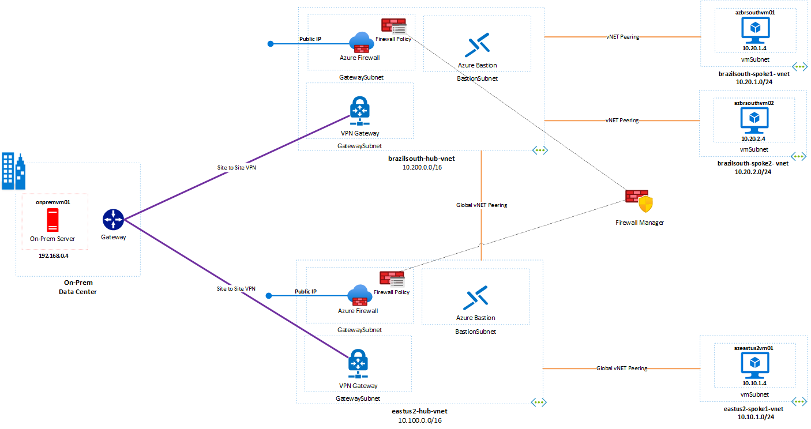

# Challenge 0: Pre-requisites - Ready, Set, GO! 

**[Home](../README.md)** - [Next Challenge >](./01-intra-forwarding.md)

## Introduction

Azure Network Security is an extensive topic, and you have lots of choices when it comes to the solution as native or custom (NVA) depends on requirements. All the elements of the hack are using a predefined Terraform template to deploy the base environment. You will deploy these resources in your Azure subscription in two differents Azure regions.

At the end of this section, your base environment build looks as follows:</br>



In Summary:

- Azure contains a Hub and Spoke topology in the each regions, containing a vitual machines in the spokes vNETs (Brazil South: azbrsouthvm01, azbrsouthvm02 and EastUS2: azeastus2vm01) and Azure Firewall in the each hub vNET  **eastus2-hub-firewall** and **brazilsouth-hub-firewall**.
- On-Premises contain a virtual machine (onprem-mgmt-vm) and enviroment simulated by Azure Virtual Network.
- Azure Bastion is deployed in all hub VNets to enable RDP and SSH connection.
- All of the workloads is deployed within a resource group called: *wth-azurefirewall-rg*.

## Description

In this challenge we will setup the core components needed to complete this What the Hack.

### Task 1 - Deploy the Environment

To start the terraform deployment, follow the steps listed below:

- Login to Azure Portal [https://portal.azure.com/](https://portal.azure.com/)
    - To start Azure Cloud Shell:
        - Select the Cloud Shell button on the menu bar at the upper right in the Azure portal. 

    

- Ensure you are properly logged in to your tenant and with a subscription selected for Azure. You can check that by using:

```azure cli
az account list --output table
az account set --subscription "My Subscription"
```

- Clone the following GitHub repository 

```azure cli
git clone https://github.com/adicout/azurefirewall-microhack
```

- Go to the folder students/terraform and initialize the terraform modules and download the azurerm resource provider

```azure cli
terraform init
```

- Now run apply to start the deployment (When prompted, confirm with a **yes** to start the deployment)

```azure cli
terraform apply
```

- Wait for the deployment to complete. This will take around 30 minutes (the VPN gateways, Azure Firewall take a while).

### Task 2 - Explore and verify the deployed resources

After the Terraform deployment concludes successfully, verify if the resources have been implemented.

- Login to Azure Portal [https://portal.azure.com/](https://portal.azure.com/)
    - To start Azure Cloud Shell:
        - Select the Cloud Shell button on the menu bar at the upper right in the Azure portal. 

    

```bash
az resource list --name wth-azurefirewall-rg
```
Verify if you can access all four virtual machines via Azure Bastion, using the following information:

|  Username  |   Password   |
| ---------  |--------------|
| azureadmin | HackP@ssw0rd |

### Task 3: Integrate Azure Firewall Solution through Azure Sentinel

## Success Criteria

1. You have a bash shell at your disposal (WSL, Mac, Linux or Azure Cloud Shell)
1. Running `az --version` shows the version of your Azure CLI
1. Visual Studio Code is installed.
