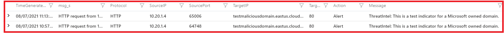
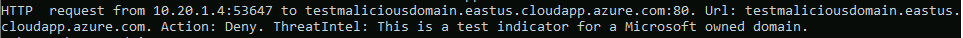

# Challenge 3: Threat intelligence

[< Previous Challenge](./00-prereqs.md) - **[Home](../README.md)** - [Next Challenge >](./02-acr.md)

## Introduction

Threat intelligence is a mechanism that provides information about threats and threat actors that helps mitigate harmful events in cyberspace. Within the  Azure firewall, you can configure it through Firewall Policies to alert or deny the traffic from known malicious IP addresses and domains. This information is provided from the [Microsoft Threat Intelligence feed](https://www.microsoft.com/en-us/security/business/operations?rtc=1)


## Description

You will set up the threat intelligence-based filtering mode as Alert and Deny when a virtual machine in Brazil Region tries to connect a malicious domain will be generated a log with the trigger. This setup will be done using the Firewall Policies.

#### Task 1 - Verify the Threat Intelligence-Based

To start the setup, follow the steps listed below:

1. Login to Azure Portal [https://portal.azure.com/](https://portal.azure.com/)
    - To start Azure Cloud Shell:
        - Select the Cloud Shell button on the menu bar at the upper right in the Azure portal. 

    

2. Ensure you are properly logged in to your tenant and with a subscription selected for Azure. You can check that by using:

```azure cli
az account list --output table
az account set --subscription "My Subscription"
```
- Create an application rules trought Firewall Policy  **azfw-policy-std**

```bash
az network firewall policy rule-collection-group collection add-filter-collection -g wth-azurefirewall-rg --policy-name azfw-policy-std --rule-collection-group-name DefaultApplicationRuleCollectionGroup --name rule-allow-site-threat-intell --action Allow --rule-name allow-site-threat-intell --rule-type ApplicationRule --source-addresses "10.20.1.4" --protocols Http=80 --target-fqdns testmaliciousdomain.eastus.cloudapp.azure.com --collection-priority 11100
```

Connect to **azbrazilsouthvm01 - 10.20.1.4** via Bastion, open the command prompt, and run it:

```cmd
curl testmaliciousdomain.eastus.cloudapp.azure.com
```

:question: What is the behavior, after you execute the curl command?

You can verify if it triggers an alert in the Azure Log Analytics. You can use the below Kusto Query:

```bash
AzureDiagnostics
| where OperationName  == "AzureFirewallThreatIntelLog"
| parse msg_s with Protocol " request from " SourceIP ":" SourcePortInt:int " to " TargetIP ":" TargetPortInt:int *
| parse msg_s with * ". Action: " Action "." Message
| parse msg_s with Protocol2 " request from " SourceIP2 " to " TargetIP2 ". Action: " Action2
| extend SourcePort = tostring(SourcePortInt),TargetPort = tostring(TargetPortInt)
| extend Protocol = case(Protocol == "", Protocol2, Protocol),SourceIP = case(SourceIP == "", SourceIP2, SourceIP),TargetIP = case(TargetIP == "", TargetIP2, TargetIP),SourcePort = case(SourcePort == "", "N/A", SourcePort),TargetPort = case(TargetPort == "", "N/A", TargetPort)
| sort by TimeGenerated desc 
| project TimeGenerated, msg_s, Protocol, SourceIP,SourcePort,TargetIP,TargetPort,Action,Message
```



#### Task 2 - Deny malicius domain in yhe threat intelligence mode

Follow the steps 1 and 2 of **Task 1** and run it Az cli command.

```bash
az network firewall policy update --name azfw-policy-std -g wth-azurefirewall-rg --threat-intel-mode Deny --sku Premium
```
Connect to **azbrazilsouthvm01 - 10.20.1.4** via Bastion, open the command prompt and run it:

```cmd
curl testmaliciousdomain.eastus.cloudapp.azure.com
```
:question: What is the result?



## Success Criteria

1. You have updated the Firewall policy with the application rule
2. You have updated the Thread Intelligence mode.
3. You block the malicious domain when you try to access it.

## Learning Resources

- [Threat Intelligence-Based ](https://docs.microsoft.com/en-us/azure/firewall-manager/threat-intelligence-settings)
